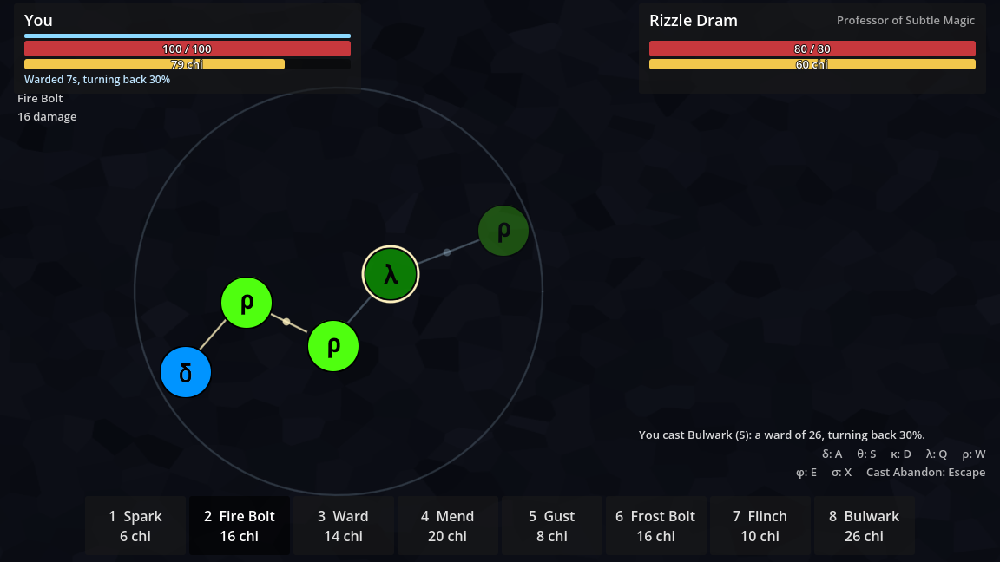
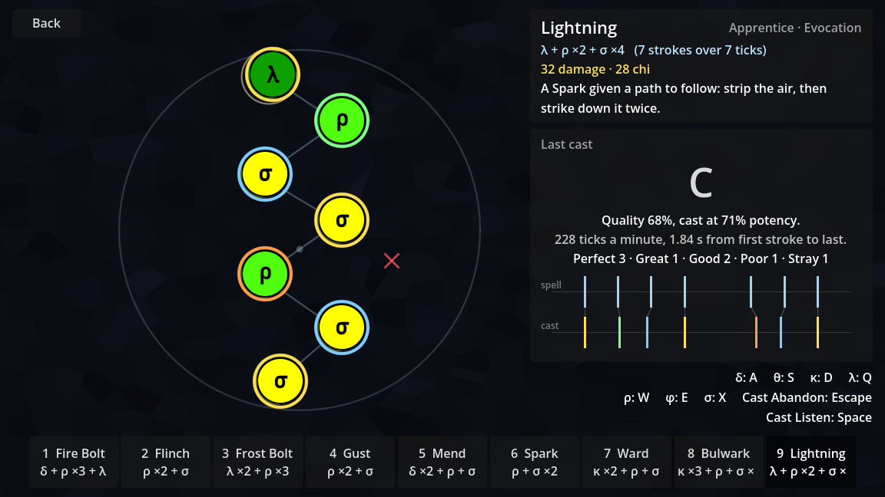
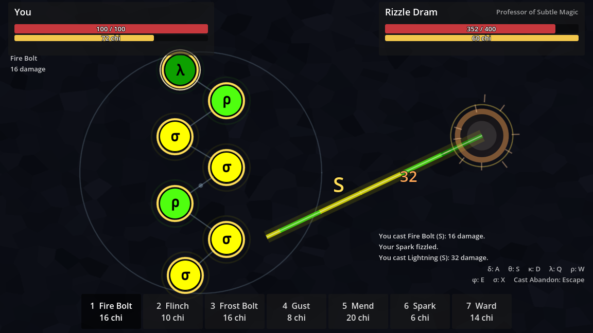
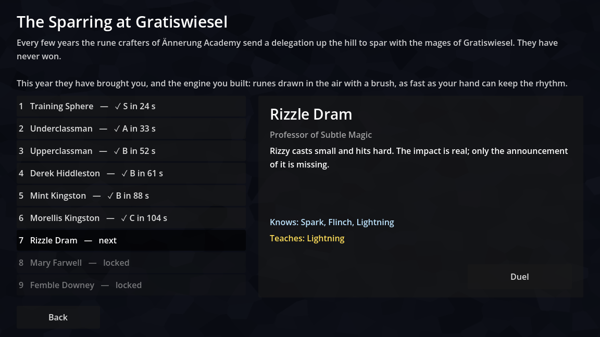

# Magiteknician

A rhythm game about casting spells, set in the world of *Another Sorcerer's Root*.

You cast a spell by striking its runes in order, in rhythm. The rhythm is fixed; the tempo is yours. Cast as fast or as slowly as you like, and the closer you keep to the spell's rhythm at the tempo you chose, the stronger the spell. You duel other casters in real time, so finishing a spell sooner is its own reward, and a clean slow cast can still lose to a rough fast one.

Built with Godot 4.7 and GDScript.



## Playing

| | |
| :- | :- |
| **Strike a rune** | Hold the cursor over it and press the key for that rune |
| δ Development | `A` |
| θ Refraction | `S` |
| κ Persistence | `D` |
| λ Decay | `Q` |
| ρ Flow | `W` |
| φ Equivalence | `E` |
| σ Variability | `X` |
| **Choose a spell** | `1` to `6`, or click its slot |
| **Hear the spell** | `Space` |
| **Give up a cast** | `Esc` or the right mouse button |

A spell is laid out as ghosts of its runes, joined in order by flow lines. The rune to strike next is ringed. Each pip on a flow line is a tick of rest: no pip means the next rune falls on the next tick, one pip means wait a tick.

Your first two strokes set the tempo. From the third, a ring closes on the next rune and meets its edge when the rune falls due *at the tempo you set*. Strike each rune as its ring closes and the cast is perfect, however fast or slow the first gap was.

Pressing a rune's key anywhere but on the rune that is next is a stray, and strays weaken the cast.

When a cast is over its beat goes on: the ring on the first rune of the next spell closes once a beat. Begin the next cast as the ring closes, at the tempo of the last, and it is **in cadence**, and stronger for it. See *Cadence* below.

While there is a rune to strike, the cursor is a ring that aims with its centre. It draws in when you strike, and trails ink in the colour of the rune that is next. The brush the game began with can be had back in the options, which is also where the game is made louder or quieter.

### Modes

- **New Game / Continue**: the campaign. Nine duels, from the academy's training sphere to the Arch-Magus. You start with three spells and learn the rest by winning.
- **Practice**: cast any spell with nothing at stake, and see how each stroke was judged. There are more spells than number keys, so the last slot turns the page.
- **Versus**: duel another player. One of you hosts, the other joins by address.

### What you bring

You know more spells than you can bring to a duel. **Six** can be brought, and which six is decided before the first stroke. They are under the keys `1` to `6`, in the order you chose them, which are the number keys the hand on the runes can reach.

- In the campaign, **Spells** in the campaign menu chooses from what you have learned. A spell you win is brought to the next duel if there is room for it.
- In versus, **Spells** in the versus menu chooses from every spell there is. Each player is told what the other brings before the duel begins, and the host will not let a spell be cast that was not brought.
- Two versions of the game with different spells can still duel. Each says which spells it has, and only the spells both have are brought.



The panel on the right shows the cast as a raster: the spell's train above, yours below, rescaled to the tempo you chose. A stroke directly under its tick was on the beat, and one to the right of it was late.

### Spells

| Spell | Runes | Chi | Does |
| :- | :- | :- | :- |
| Spark | ρ σ | 6 | 5 damage |
| Gust | ρ σ | 8 | Wears a ward down by 16, and 3 damage |
| Flinch | ρ σ | 10 | Breaks the cast the foe is part-way through |
| Ward | κ ρ σ | 14 | Soaks up 12 damage for 8 s |
| Fire Bolt | δ ρ λ | 16 | 16 damage |
| Frost Bolt | λ ρ | 16 | 12 damage, and chills for 6 s |
| Mend | δ ρ σ | 20 | Heals 12 |
| Bulwark | κ ρ θ σ | 26 | Soaks up 26 for 10 s and turns 30% of it back |
| Lightning | λ ρ σ | 28 | 32 damage |
| Transmute | κ φ δ | 8 | Makes up to 20 of your ward into health |
| Exchange | κ φ θ | 18 | You and the foe have each other's wards |
| Echo | φ θ ρ σ | 18 | Casts the foe's last spell again, as yours, at 75% |
| Sunder | ρ δ σ | 16 | Wears a ward down by 30, and 8 damage |
| Stillness | λ θ σ κ | 18 | Breaks the foe's cast, and chills for 8 s |
| Rime Lance | λ κ ρ σ | 24 | 22 damage, and chills harder for 8 s |
| Restoration | δ κ σ | 34 | Heals 30 |
| Aegis | κ θ σ ρ | 36 | Soaks up 40 for 12 s and turns half of it back |
| Cataclysm | δ ρ λ σ | 44 | 50 damage |

Those are the amounts for a flawless cast. What a cast delivers is scaled by how well it was cast.

- Chi is paid when a cast begins and is not returned if the cast fizzles, is broken or is given up.
- A ward keeps an interruption out.
- While you are chilled, your strokes are judged more strictly. A flawless cast is untouched.
- A duel escalates after its first minute: damage climbs, and wards and mending do not.
- Transmute, Exchange and Echo use φ, Equivalence, which reads a state or rewrites one. Each takes something that is already there and has it be something else, or somebody else's.
- **Exchange** does not mind which caster has which ward. Cast it with the better ward of the two and you are the worse for it.
- **Echo** echoes the last spell of the foe's that took effect. What was the foe's own, a ward or a mending, is your own. An echo of an echo is of nothing, but what an echo echoed counts as what you cast, so two casters can send one spell back and forth.

### What a spell looks like



A spell that is aimed at the foe crosses to them as a streak. It sets out from the last rune you struck and is banded in the colours of the spell's runes, so a spell can be told by its streak. How much a spell did is how big it is drawn.

| You see | It means |
| :- | :- |
| A letter beside the caster | The grade of the cast |
| A wider streak | A cast of more potency |
| A burst, and a number | Damage that got through, and how much |
| A gold ring round the burst | The cast was flawless |
| A ring round a circle | A ward. It is as thick as the ward is strong, and runs down clockwise as the ward's time does |
| A second, thin ring outside it | The ward turns blows back |
| An arc flaring on a ward | The ward took a blow on that side |
| A streak that stops at a ward | Nothing got past it |
| A pale streak coming back | What the ward turned back |
| A ring flying to pieces | The ward was used up |
| Motes rising | Health coming back |
| Icicles round the rim of a circle | Its caster is chilled |
| Cracks across a circle | The cast on it was broken |
| A puff of grey | The cast fizzled |

What is shown is heard as it is seen, and a harder blow is louder and lower. The sounds are worked out by the game, from notes of the scale the runes chime in. A recording takes the place of any of them: put a file called `blow`, `ward_blow`, `ward_up`, `ward_break`, `mend`, `chill`, `break` or `fizzle`, as `.ogg`, `.wav` or `.mp3`, in `magiteknician/assets/audio/spells/`.

### Rhythms

The first spells are nearly even: a stroke a tick, with a rest here and there. The spells of the higher ranks are not, and their rhythms have to be learned. The practice range writes a spell's rhythm as the ticks from each stroke to the next, and `Space` plays it.

| Spell | Rhythm | Which is |
| :- | :- | :- |
| Sunder | 1 1 2 1 1 2 | A gallop: short, short, long |
| Stillness | 1 2 1 2 1 | A limp: short, long |
| Rime Lance | 3 3 2 3 | Three, three, two |
| Restoration | 1 1 5 1 1 | Three strokes, a silence, and three more |
| Aegis | 3 3 4 2 2 1 1 | The clave, and three to close |
| Cataclysm | 2 3 2 3 2 1 1 2 | Twos and threes, and a run |

Three against two is the hard part. A spell in threes and twos has no tick that every stroke falls on, so there is nothing to count but the rhythm itself.

No two spells have the same rhythm, so a spell can be told by ear.

## How a cast is judged

A spell's rhythm is written in **unscaled ticks**. "Strike at 0, 1 and 3" says the second gap is twice the first and nothing about how long either is.

1. **Find the tempo.** The least-squares line through (tick, time of stroke) gives the length of one tick at the tempo the caster was evidently casting at.
2. **Measure the deviation.** Each stroke's distance from that line, divided by the length of a tick, is how far off the beat it was, in ticks. It is a ratio, so it reads the same at any speed.
3. **Score each stroke** on a gaussian centred on the beat.
4. **Modify by aim.** Striking a rune off-centre takes a little off. Aim cannot rescue a cast with no rhythm.
5. **Subtract for strays.**

```
quality = rhythm × aim_factor − strays × penalty
```

Quality gives a grade (S, A, B, C, D or Fizzle) and the **potency** the spell takes effect at. Every number involved is in `CastTuning`.

In spike-train terms this is an edit distance in the manner of Victor and Purpura, taken after rescaling time to the caster's own tempo. Moving a spike costs more the further it moved, an extra spike has a fixed cost, and a missing spike costs the whole cast.

Rushing or dragging the *whole* cast is a tempo, not a mistake. Speed is harder only because the same error in milliseconds is a larger share of a shorter beat.

### Cadence

A cast is judged on its own. Cadence is what joins one cast to the next.

A cast follows the one before it if it goes on in the same beat:

| | It follows if |
| :- | :- |
| **It begins on a beat** | within 0.15 of a tick of one |
| **At the same tempo** | within a tenth of it |
| **Without too long a rest** | at most 8 beats after the last stroke of the cast before |

Each cast in a row that follows the one before it is 5% stronger than the last, up to 20%. That is on top of what the cast earned by its rhythm, and multiplies it, so a poor cast in cadence is still a poor cast. It makes a blow, a ward and a mending stronger alike.

A fizzle ends the cadence. So does giving up a cast, and having one broken, which is one more use for Flinch. Choosing another spell does not: the beat belongs to the caster and not to the spell.

The beat that is carried forward is the one that was fitted to the cast, and not the time of any one stroke. So a first stroke that is late, in a cast that is otherwise on the beat, is one stroke off.

As spike trains go, the casts are bursts, and this asks whether the bursts are locked to one oscillation or each to its own.

Keeping a cadence is a choice. The beat will not wait while you decide whether to ward, and the blow you have seen coming may land between beats.

That goes for the game's errors as well as the caster's. The game hears of a stroke when it next comes round, and how long that is differs from stroke to stroke, which looks like unsteadiness in the hand. So while there is a rune to strike the game comes round 500 times a second and not once a frame. This is what it is worth to a hand that is off the beat by a fiftieth of a tick, casting Lightning:

| A tick lasts | Graded S, keys read 60 times a second | 144 times | 500 times |
| :- | :- | :- | :- |
| 330 ms | 97% | 99% | 100% |
| 250 ms | 90% | 99% | 100% |
| 150 ms | 59% | 98% | 100% |
| 100 ms | 66% | 91% | 100% |
| 80 ms | 0% | 84% | 100% |

## Running it

Open the project in Godot 4.7 and press play.

### Tests

```sh
GODOT=/path/to/godot tests/run.sh
GODOT=/path/to/godot tests/run.sh --only=casting
```

```powershell
$env:GODOT = 'C:\path\to\godot.exe'
tests\run.ps1
```

There are two parts, and both run headless, on every pull request.

- **The tests** live under `tests/`, in files named `test_*.gd` that extend `TestCase`. Each checks one thing on its own. A script error during a test fails the test. They take under half a minute.
- **The play-through** (`tests/play_through.tscn`) starts at the main menu and plays: a new game, a duel won, progress saved, and a visit to every other screen. It follows the game through real changes of scene, which the tests cannot. It takes about as long again, most of it spent waiting for fades.

With `--only`, the play-through is left out.

## Releases

The game's version is kept by [Changesets](https://changesets.dev). Versions are `major.minor.patch`.

### When you change the game

Add a changeset to the pull request that makes the change:

```sh
npx changeset
```

It asks how big the change is and what to tell players about it, and writes a small file under `.changeset/`. Commit it with the change. The file can also be written by hand; `.changeset/README.md` shows what goes in it.

| Bump | When | 1.4.2 becomes |
| :- | :- | :- |
| `patch` | A fix. Nothing new. | 1.4.3 |
| `minor` | Something new: a spell, an opponent, a mode. | 1.5.0 |
| `major` | Something that breaks what came before: old saves no longer load, or the two versions can no longer duel each other. | 2.0.0 |

A change players would never notice, to the tests or to this file, needs no changeset. Every pull request gets a comment saying whether it has one.

### When you want to release

1. While changesets are waiting on `main`, a pull request called **Release: promote the changes that are waiting** is kept open and up to date. It raises the version by the biggest bump among the changesets, in `package.json` and in `project.godot`, writes `CHANGELOG.md`, and removes the changesets.
2. **Merge it.** That is the release.
3. The version is tagged (`v0.1.0`) and a GitHub release is written from the changelog.
4. The game is built for Windows and Linux from that tag, each build is run to see that it is whole, and both are attached to the release. This takes a few minutes, so the release is there a little before its downloads are.

Nothing is released until that pull request is merged, so changes can gather on `main` for as long as you like.

The main menu shows the version in its corner.

### Setting it up

Two things, once:

- **The tooling needs Node 22.11 or later.** `nvm use 24` if you have it, then `npm install`.
- **GitHub has to be allowed to open the pull request.** In the repository's settings, under *Actions > General > Workflow permissions*, tick *Allow GitHub Actions to create and approve pull requests*.

### What to know

- **GitHub does not run workflows on a pull request that a workflow opened.** The release pull request will show no checks. The tests run when it is merged, and can be run on its branch by hand from the Actions tab. To have them run by themselves, give the release workflow a token of its own; the [Changesets guide](https://changesets.dev/guide/automating#run-github-actions-for-version-prs) says how.
- **The version is in two files and Changesets only knows about one.** `scripts/release/sync_version.mjs` copies it from `package.json` to `project.godot`. If you ever raise the version by hand, run it. A test fails while the two differ, and nothing will be tagged.
- **If a release is missing its downloads**, because the build failed or was made before there were builds, run the **Build** workflow by hand from the Actions tab and give it the release's tag. It builds from that tag and attaches what it builds, replacing anything already there.

### Builds

| Platform | Download | Holds |
| :- | :- | :- |
| Windows, 64-bit | `Magiteknician-v0.1.0-windows-x86_64.zip` | `Magiteknician.exe` |
| Linux, 64-bit | `Magiteknician-v0.1.0-linux-x86_64.tar.gz` | `Magiteknician.x86_64` |

Each is one file with the whole game inside it. There is nothing to install.

Every pull request is built as well. The builds are kept with the run for a week, under *Artifacts* on the run's page, so a change can be played before it is merged.

To build on your own machine, with the export templates for your version of Godot installed:

```sh
GODOT=/path/to/godot scripts/release/export.sh
```

The builds are written to `build/`, which git ignores.

**A build can be asked whether it is whole:**

```sh
Magiteknician.exe --headless -- --self-check
```

It looks for every spell, opponent and scene the game needs, says what it could not find, and exits with 0 or 1. The tests cannot answer this, because they are left out of a build, and a build finds its files differently from the editor.

**The builds are not signed.** Windows will say the publisher is unknown the first time the game is run, and offer *More info > Run anyway*.

## How the code is laid out

```
magiteknician/
  engine/
    components/   Rune, and the trains: ExpectedTrain (the ghosts to follow)
                  and ActualTrain (the marks where strokes landed)
    casting/      RhythmFit, CastScorer, CastResult, CastTuning, SpellCircle;
                  Cadence, which joins one cast to the next;
                  StrokePace, which says how often the keys are read
    cursor/       CursorArt, which draws the cursors; GameCursor, which shows
                  them; InkTrail
    show/         SpellShow, which shows a spell landing; SpellMark;
                  SpellVoice, which sounds it; SpellSounds
    spells/       Spell, RuneStroke, SpellEffect, Spellbook, SpellLibrary,
                  Loadout
    combat/       Duelist, Duel, SpellResolver, Opponent, and the casters:
                  Caster, NpcCaster, NpcBrain, CasterProfile, CastPlan
    campaign/     Campaign, CampaignStage, SaveGame
    net/          DuelProtocol, NetLink, StrokeSender, RemoteCaster,
                  DuelHost, DuelGuest, DuelMirror
  hud/            The duel's HUD and its parts
  levels/         The practice range, the duel arena, the versus arena
  menus/          The main, campaign, versus and options menus
  spells/         One .tres for each spell
  opponents/      One .tres for each opponent
  campaigns/      One .tres for each campaign
  session.gd      What one scene tells the next, and the player's progress
  settings.gd     What the player has chosen in the options
  self_check.gd   Lets a build be asked whether it is whole
tests/
scripts/release/  Copies the version into project.godot; tags a release;
                  builds the game
.changeset/       The changes waiting to be released
package.json      Where Changesets keeps the version
export_presets.cfg  What a build of the game is made of
```

Five ideas hold it together.

**Every stroke goes through `SpellCircle.strike()`.** The keyboard, an NPC, a test and a player on another machine all make strokes the same way and are judged by the same code.

**Spells, opponents and campaigns are data.** Each is a resource in a file. Nothing about a particular spell is written in code.

**The cursor belongs to the operating system.** The game draws the picture and the system moves it, so the cursor is where the hand is and never a frame behind. What the game draws for itself, the ink trail and the splash of a stroke, is decoration that nobody aims with.

**What is shown changes nothing.** `SpellShow` is told what a cast did and draws it. It has no say in what happens, so a duel comes out the same with it as without it, and the rules can still be played out with nothing on the screen.

**The rules have no nodes behind them.** `Duelist`, `CastScorer` and `SpellResolver` are plain objects and pure functions. Time passes only when `advance()` is called, so a whole duel can be played out in a test, or simulated thirty times to try the balance of an opponent.

### Adding a spell

In the editor:

1. Add a node with the `ExpectedTrain` script to a scene. Its origin is the centre of the spell circle.
2. Add runes under it (`engine/components/runes/*.tscn`), place them, and set each one's **Unscaled Ticks**. The first is on tick 0 and each later one on a later tick.
3. Set **Spell Path** to `res://magiteknician/spells/<id>.tres` and press **Save runes to spell file**.
4. Open the new `.tres` and give it a name, a description, a school, a rank, a chi cost and its effects.

The spell is now in the library and shows up in the practice range. To put it in the campaign, add its id to a stage's rewards or to an opponent's spells.

A spell wants at least three strokes. Any two points fit a line, so a spell of two strokes cannot be off the beat.

### Adding an opponent

Duplicate a file in `magiteknician/opponents/` and change it. What makes an opponent hard is mostly two numbers in its profile: **Timing Error**, the jitter of its strokes around the beat in ticks, and **Usec Per Tick**, its tempo. An opponent is never told how well to cast. It is given hands, and how well it casts follows.

**Cadence** is the chance that they go on in the beat of their last cast. The students do not, and the Arch-Magus nearly always does. An opponent who thinks for longer than eight of their own beats cannot, whatever it says.

| Timing error | Fire Bolt most often comes out | Mean potency |
| :- | :- | :- |
| 0.02 | S (85% of casts) | 97% |
| 0.06 | A (58%) | 91% |
| 0.10 | B (42%) | 82% |
| 0.16 | C (40%) | 67% |

`DuelSimulation` plays duels between two opponents with nobody at the keyboard. Use it to see how a new opponent fares before anyone has to play them.



## The world

The runes, the spells and the people are from *Another Sorcerer's Root*. The campaign is the sparring match of its fifth chapter, seen from the visitors' side: every few years the rune crafters of Ännerung Academy send a delegation to spar with the mages of Gratiswiesel, and they have never won.

| Rune | Name | In a spell it |
| :- | :- | :- |
| ρ | Flow | pushes, throws, gives a direction |
| δ | Development | builds up, combines |
| λ | Decay | breaks down, chills |
| θ | Refraction | turns aside, bends light |
| κ | Persistence | makes an effect last |
| σ | Variability | evaluates a gaussian, centred on intention |
| φ | Equivalence | reads or rewrites a state |

## What is not done

- The numbers have been tuned by simulation and not yet by people.
- The keys are read 500 times a second while there is a rune to strike, so a stroke is timed to within 2 ms. The engine does not say when a key was struck, so this is done by coming round more often, which works the machine harder. It can be turned off in the options.
- The menus other than the main menu are silent.
- The sounds of a spell landing were worked out and measured, and have not been listened to by whoever made them.
- A spell is shown landing in a duel, and not in the practice range, where there is nobody for it to land on.
- The options menu has three options: the cursor, the volume, and how closely the keys are read. There is none for the window or for which keys, and the volume is of everything at once.
- Versus has no list of hosts, no rematch, and a fixed port.
